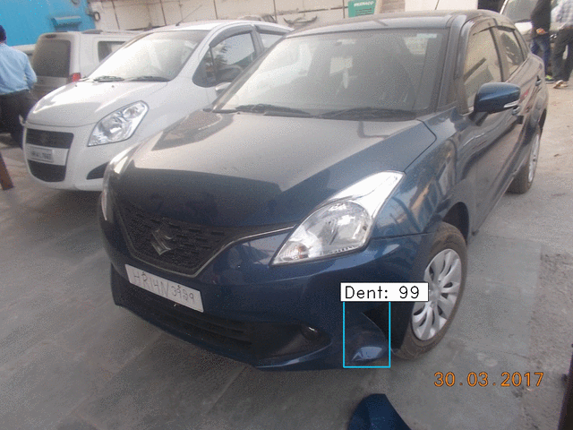

# Faster RCNN

Keras implementation of Faster R-CNN: Towards Real-Time Object Detection with Region Proposal Networks. originally from https://github.com/yhenon/keras-frcnn/




* Annotations and Image data can be found in the [data](Data) directory.

* Code file : [Faster_RCNN.ipynb](Faster%20RCNN.ipynb)

* Install pre-requisites
```
$ pip install -r requirements.txt
```

* Scripts for creating annotations are included in the code.

* Results get stored in the *results_imgs* folder created in the main directory itself.
Results of the implemented models can be found [here](saved%20models)

* mAP implementation is present in [main.py](main.py) file, originally by [Cartucho](https://github.com/Cartucho/mAP#create-the-ground-truth-files)

* mAP calculation makes use of *ground-truth* and *detection-results* from the *input* directory. Detection Results are automatically added by [test_frcnn.py](test_frcnn.py).
